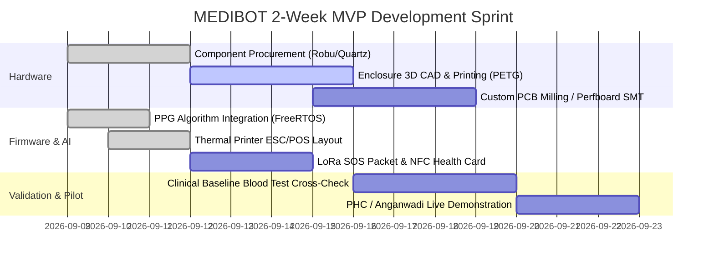

# 🏆 MEDIBOT: Funding, Government Grants & Mentor Pitch Guide

इस गाइड में Antigravity मेंटर्स के साथ बातचीत, इन्क्यूबेशन, और भारत सरकार की शीर्ष मेडिकल व हार्डवेयर ग्रांट्स (Grants) के लिए आवेदन करने की पूरी रणनीति दी गई है।

---

## 💰 1. शीर्ष सरकारी ग्रांट्स (Top Grants for MEDIBOT - 100% Non-Dilutive / Equity Free)

| ग्रांट का नाम | अनुदान राशि (Amount) | नोडल एजेंसी | फोकस एरिया | MEDIBOT के लिए फिट क्यों है? |
|---|---|---|---|---|
| **1. BIRAC BIG (Biotechnology Ignition Grant)** | **₹50,00,000 (₹50 Lakhs)** | DBT (डिपार्टमेंट ऑफ बायोटेक्नोलॉजी) | मेडिकल डिवाइसेज, बायो-सेंसर, हेल्थ-टेक | नॉन-इनवेसिव हीमोग्लोबिन और रूरल डायग्नोस्टिक्स के लिए भारत की सबसे बड़ी और प्रतिष्ठित ग्रांट। |
| **2. NIDHI-PRAYAS** | **₹10,00,000 (₹10 Lakhs)** | DST (डिपार्टमेंट ऑफ साइंस एंड टेक्नोलॉजी) | हार्डवेयर प्रोटोटाइपिंग और लैब टेस्टिंग | ESP32, मोल्डिंग, कस्टम PCB, और पहले 50 प्रोटोटाइप्स बनाने के लिए आदर्श। |
| **3. Startup India Seed Fund (SISFS)** | **₹20,00,000 (₹20 Lakhs)** | DPIIT | प्रोटोटाइप वैलिडेशन और फील्ड ट्रायल्स | इनक्यूबेटर के माध्यम से पायलट टेस्टिंग और क्लिनिकल डेटा वैलिडेशन के लिए। |
| **4. MeitY TIDE 2.0 (IoT & Sensors)** | **₹4,00,000 - ₹7,00,000** | इलेक्ट्रॉनिक्स और सूचना प्रौद्योगिकी मंत्रालय | IoT, हार्डवेयर कियॉस्क | LoRaWAN और ऑफलाइन रूरल कियॉस्क के हार्डवेयर R&D के लिए। |
| **5. ICMR (Indian Council of Medical Research)** | **₹20 - ₹40 Lakhs** | स्वास्थ्य एवं परिवार कल्याण मंत्रालय | मातृत्व एवं बाल स्वास्थ्य (MCH) और एनीमिया मुक्त भारत | पोषण ट्रैकर और गर्भवती महिलाओं में एनीमिया उन्मूलन के लिए। |

---

## 🎯 2. Antigravity टीम और मेंटर्स के साथ चर्चा रणनीति (Mentor Pitch Strategy)

जब आप Antigravity मेंटर्स के साथ बैठें, तो अपने 5 मुख्य बिंदुओं को इस प्रकार प्रस्तुत करें:

### बिंदु 1: हार्डवेयर और सप्लाई चेन (Hardware & Enclosure)
- **आपकी बात**: *"हमारे पास ESP32, MAX30102 और LoRa का ब्रेडबोर्ड और स्कीमेटिक प्रोटोटाइप तैयार है। क्या Antigravity के पास रैपिड 3D प्रिंटिंग (रग्ड केसिंग) और 2-लेयर SMT PCB मैन्युफैक्चरिंग पार्टनर्स (जैसे LionCircuits या Prototyping Labs) का एक्सेस है जिससे हम 10 दिनों में इसे एक कॉम्पैक्ट हैंडहेल्ड डिवाइस का रूप दे सकें?"*

### बिंदु 2: सेंसर कैलिब्रेशन (Optical PPG to Hb via AI)
- **आपकी बात**: *"MAX30102 के Red (660nm) और IR (880nm) वेवफॉर्म से हमने $R$-रेशियो और परफ्यूजन इंडेक्स का मल्टिवेरीएट रिग्रेशन मॉडल तैयार कर लिया है (जो ESP32 के C++ में सीधे रन होता है)। हमें 100-200 असली पेशेंट्स के लैब हीमोग्लोबिन ब्लड टेस्ट डेटा के साथ इस मॉडल को फाइन-ट्यून और क्लिनिकली वैलिडेट करना है। क्या आपकी टीम डेटा साइंस या बायो-मेडिकल मेंटर्स से कनेक्ट करा सकती है?"*

### बिंदु 3: इन्क्यूबेशन और पायलट टेस्टिंग (Pilot at PHC / Anganwadi)
- **आपकी बात**: *"हमारा 2-हफ़्ते का MVP रेडी है। क्या Antigravity हमें किसी जिला प्रशासन (District Magistrate / CMO), नीति आयोग के आकांक्षी जिले (Aspirational District), या ग्रामीण एनजीओ के साथ 1 PHC और 3 आंगनवाड़ी केंद्रों में 50 महिलाओं पर 30-दिन का पायलट रन करने का 'लेटर ऑफ सपोर्ट' (Letter of Support) या इंट्रोडक्शन दिला सकता है?"*

### बिंदु 4: सरकारी API (ABDM & Poshan Tracker Integration)
- **आपकी बात**: *"हमने नेशनल हेल्थ अथॉरिटी (NHA) के ABDM माइलस्टोन M1/M2 के अनुसार FHIR JSON फॉर्मेट का आर्किटेक्चर बना लिया है। हमें ABDM सैंडबॉक्स (Sandbox) एक्सेस और महिला एवं बाल विकास मंत्रालय के 'पोषण ट्रैकर' API के साथ आधिकारिक पार्टनरशिप या डेटा-शेयरिंग एग्रीमेंट का लीगल पाथवे समझना है।"*

### बिंदु 5: सीड फंडिंग और ग्रांट एप्लिकेशन
- **आपकी बात**: *"हम BIRAC BIG (Call 26/27) और NIDHI-PRAYAS में आवेदन कर रहे हैं। क्या Antigravity एक इनक्यूबेशन पार्टनर के रूप में हमारे ग्रांट एप्लिकेशन को एंडोर्स (Endorse) कर सकता है, जिससे हमारे चयन की संभावना 90% बढ़ जाएगी?"*

---

## 📝 3. 2-हफ़्ते का MVP रोडमैप (2-Week Rapid MVP Sprint)

